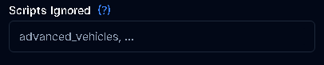
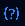

# READ THIS

For 99% of you, the false bans on your server are likely due to you ignoring your scripts in the configuration, often because you mistakenly believe this will prevent false bans or think that WaveShield is causing script errors.

Let me clarify: ignoring your scripts will only lead to more false bans, as WaveShield won't be able to validate legitimate actions if it isn't properly integrated with those resources. Additionally, **WaveShield cannot cause script errors**.

So please, **DON'T ADD ANYTHING THERE UNLESS YOUR SCRIPT IS NOT STARTING**.

:::warning
Only add scripts to the ignore list **if they are NOT STARTING** when WaveShield is installed into it. Script errors are never due to WaveShield; only ignore your scripts if they are not starting.
:::
:::tip
There are little tooltips  above every feature on the configuration page so you can know what the option does or find any information about it if you don't know their use.
:::
