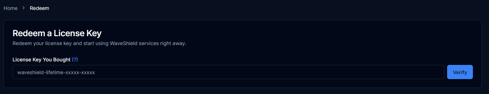

# Redeem WaveShield

Redeeming WaveShield is very easy. After your purchase, you will receive an email with a unique license key in an attached file. The key looks like `waveshield-lifetime-xxxxxxxxxxxxx`.

You'll need to redeem it. To do so, access the panel on the redeem page and enter your key as in the example below.

:::note
When you have followed these steps you can start the installation.
:::
